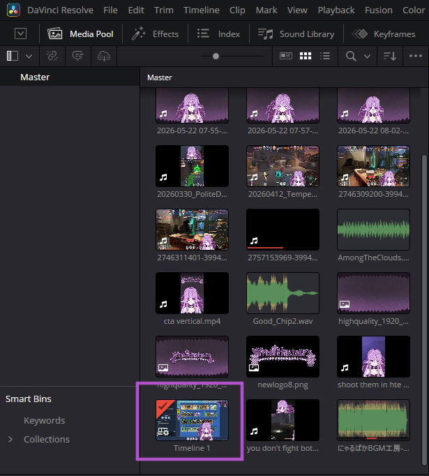
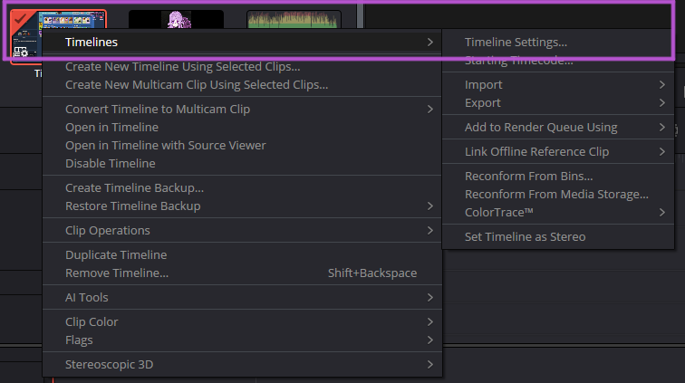
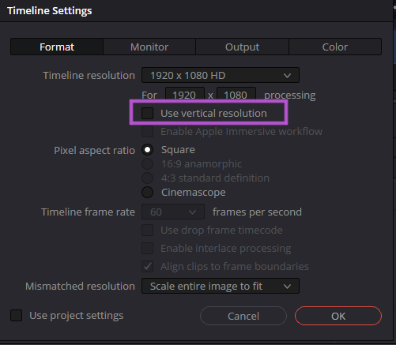
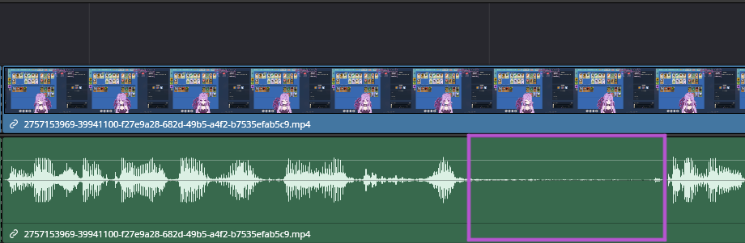
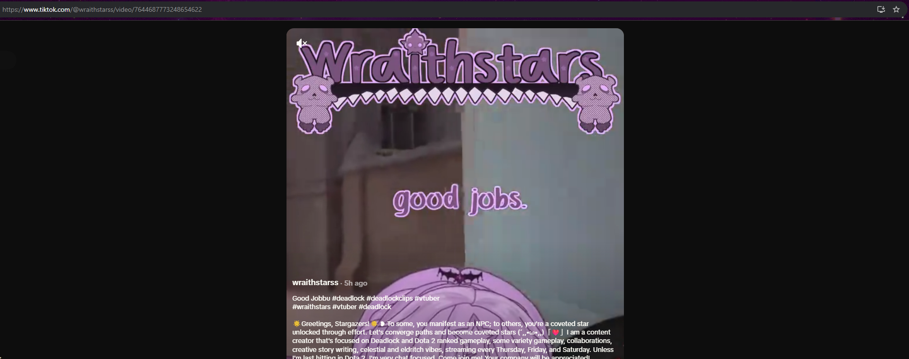
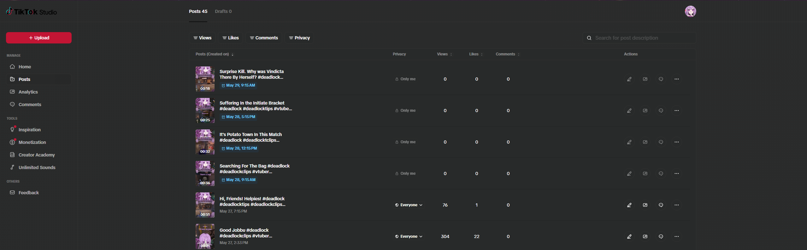
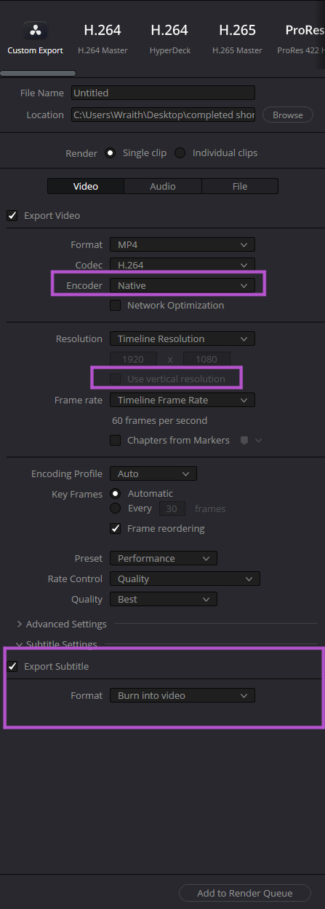

# Recording and Clipping Workflow

You can create clips from videos you record, but you can't necessarily create clips directly in OBS. What you would do is set up OBS, configure the recording tab, record your videos, and then edit them in a video editing software.

## Step-by-Step

1. Go to Settings in OBS → Output.
2. Change Output Mode to Advanced.
3. Go to the Recording tab.
4. Set your Recording Path to wherever you want the videos saved.
5. Set Recording Format to MP4.
6. Set your Encoder:
   - If you have NVIDIA: use NVENC
   - If you have AMD: use x264
7. Set your recording quality. A good starting point is:
   - Rate Control: CQP
   - CQ Level: 18–23
   - Lower number = higher quality / larger file.
8. Go to Settings → Video and make sure your resolution is set correctly. Usually:
   - Base Canvas: your monitor resolution
   - Output Scaled: 1920x1080
   - FPS: 60 or 30
9. Press Start Recording when you want to capture gameplay or stream content.
10. When you're done, press Stop Recording.
11. Open the recorded video in an editor.

I used DaVinci Resolve Studio. It's the best editor I've ever used without costing an exuberant amount of money. I started with Sony Vegas Pro, I tried Lightworks Studio, I've tried a few others, but this one is by far the best. They have a free version, it's called [Davinci Resolve](https://www.blackmagicdesign.com/products/davinciresolve/studio). 

12. This is kind of complicated to explain, so you might want to Google it, but if you're in DaVinci Resolve you need to go to your Timeline Settings and set the resolution to match your output resolution on your raw videos. In this case, it would be 1920x1080. But if you want to make Shorts or actual clips and not widescreen content, then you need to change the resolution to vertical form. In DaVinci Resolve, there's a checkbox that will just flip the resolution for you. In a lot of other video editing software, they make you change the resolution manually.

13. Take your raw video, put it into the tracks, and then cut down what you don't need. If you're making clips or Shorts, you want to optimize the most interesting part of whatever you're trying to share. People click off of videos they don't think are interesting within the first four seconds. So if you have four seconds of no audio because it's a transition into something more interesting, people are more likely to click off.

14. You're going to find mixed information on whether you should use tags and how often you should post. My advice is: every algorithm wants more content, so if you can post very regularly, or schedule regularly, it's much more likely to push your content. Using tags is what helps the algorithm figure out where to push your content. Using titles for your clips that relate to what you're actually posting is also another way to help the algorithm figure out where to send your content. Because if you're going to be making Fortnite content, you don't want it going to people who only watch beauty content.

15. What I would suggest is: record and clip a lot of videos. Figure out how often you want to be posting and how many clips you need to be able to do that for a month, and then go from there. For example, I want to post at least three clips a day, every single day. So in 30 days I need 90 clips. That's a lot of clips. That's a lot for people who aren't used to editing and clipping. You have to be realistic with yourself, or you will end up letting yourself down and creating a burnout that was preventable.

## Consistency and the Algorithm

If you look through all of my social media for Wraithstars, what has hindered every single platform is any time I take a break. The algorithm doesn't like that, followers don't like that, and it's just not good if you actually want to grow. Along a similar note, every time my accounts grow in followers, it has only been during times when I am consistently posting.

Once you figure out how many videos you want to post, TikTok does have a way to schedule videos. Setting up a day where you record videos, a different day where you edit videos, and a different day where you schedule videos works for a lot of people.

## My Video Pipeline

I stream to Twitch and YouTube. YouTube has more discoverability, but Twitch is where I first got started. When I'm ready to edit videos, I go to my Twitch and clip the videos there, because they have a really nice way of editing that lets you capture your gameplay and your webcam, or in my case, my VTuber model. You can see this on my YouTube Shorts.

Then I download my clips from Twitch, take them into DaVinci Resolve Studio, and edit them. There are many, many ways to edit videos, all different types. Right now, because I'm mostly focused on Shorts and clips, my focus is reaching as many people as possible. DaVinci Resolve Studio has a way of automatically adding subtitles on top of your video on a new track. I use this on all of my videos, including long-form and short-form.

When you're done editing your video, you need to render it, which just means placing all the things you wanted together into one clip. In my case, I have my raw video clip, my subtitles, my logo image, and sometimes background music or sound effects. Then you render your video.

In a lot of video editing software, the project settings are the render settings. But again, in my case, in DaVinci Resolve Studio, I make sure that my video is processed with my native rendering on my GPU, and I make sure that the subtitles are exported as embedded in the video. Then I render.

